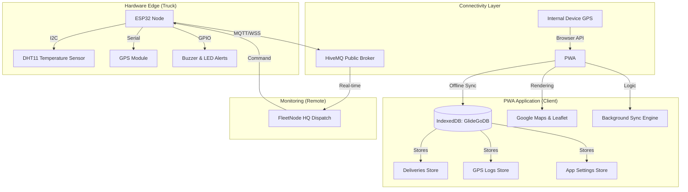

# GlideN'Go: Professional Fleet & Cold-Chain Logistics PWA

GlideN'Go is a state-of-the-art Progressive Web App (PWA) designed for professional B2B logistics, specifically optimized for cold-chain management and real-time fleet tracking across Philippine highways. It bridges the gap between physical hardware (ESP32 sensors) and high-performance digital dashboards.

---

## 🏗️ System Architecture

The GlideN'Go ecosystem is built on a distributed "Edge-to-Cloud-to-UI" architecture, ensuring data integrity even in low-connectivity areas of provincial highways.

---

## 🔄 Data Workflow (IPO Model)

### 📥 Input
- **Hardware Telemetry:** Real-time Latitude, Longitude, and Temperature from ESP32 via MQTT.
- **Device Sensors:** Internal GPS coordinates from the smartphone/tablet.
- **User Actions:** Route selection, stopover assignments, and theme toggling.
- **Static Assets:** Philippine highway maps and stopover location data.

### ⚙️ Process
1.  **Standardization:** Mapping various input sources (MQTT vs. Device GPS) into a unified `coords` schema.
2.  **Cold-Chain Analysis:** Real-time comparison of container temperature against threshold (29°C) to trigger spoilage alerts.
3.  **AI Rerouting:** Analyzing driving time (5h limit) and traffic to suggest optimal rest stops and calculate new ETAs.
4.  **Sync Management:** Queuing GPS logs in IndexedDB for batch uploading when the network is unstable.

### 📤 Output
- **Driver Navigation:** Dynamic Google Maps route with real-time waypoint injection.
- **HQ Dispatcher:** High-tech Leaflet map showing global fleet status and cargo integrity.
- **Haptic/Visual Feedback:** Physical buzzer alarms on the ESP32 and UI toast notifications.
- **Transparency Reports:** Exportable CSV logs for delivery audit trails.

---

## 🚀 Key Features

- **PWA Excellence:** Offline-first architecture with background sync capabilities.
- **Dual GPS Mode:** Toggle between specialized hardware nodes and internal device sensors.
- **Glide-Sync Reroute:** Intelligent automation that suggests and sets stopovers during congestion or driver fatigue.
- **Cold-Chain HQ:** Dedicated dispatcher view for monitoring high-risk perishables.
- **Dark/Light Mode:** Optimized for both high-glare daytime and low-light night driving.

---

## 🛠️ Tech Stack

- **Core:** Vanilla JS (ES6+), Semantic HTML5, CSS3 Tokens.
- **Maps:** Google Maps Platform (Routing/ETA) & Leaflet (Fleet Visualization).
- **Storage:** IndexedDB (via `db.js` wrapper).
- **Messaging:** MQTT over WebSockets.
- **Design:** Industrial B2B aesthetic with Glassmorphism and CSS Animations.

---

## 📄 License
© 2024 GlideN'Go Logistics. Developed for professional fleet transparency.
