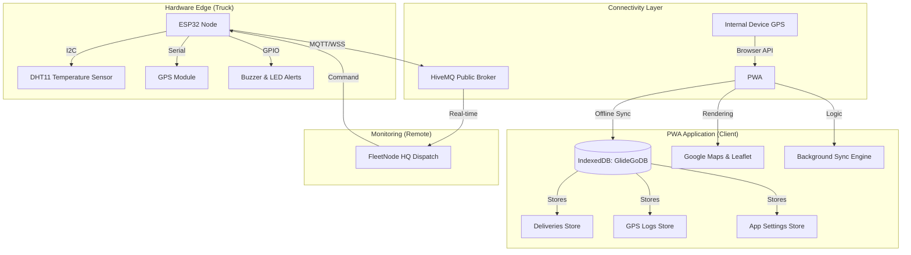

# GlideN'Go: Professional Fleet & Cold-Chain Logistics PWA

GlideN'Go is a state-of-the-art Progressive Web App (PWA) designed for professional B2B logistics, specifically optimized for cold-chain management and real-time fleet tracking across Philippine highways. It bridges the gap between physical hardware (ESP32 sensors) and high-performance digital dashboards.

---

## 🏗️ System Architecture

The GlideN'Go ecosystem is built on a distributed "Edge-to-Cloud-to-UI" architecture, ensuring data integrity even in low-connectivity areas of provincial highways.

---

## 🔄 Detailed Data Workflow (IPO Model)

GlideN'Go operates on a precise Input-Process-Output (IPO) model to ensure high-fidelity logistics monitoring and driver safety.

### 📥 Input (The "Data Harvest")
- **ESP32 Hardware Node:** 
    - **GPS Stream:** Latitude/Longitude via NMEA sentences, transmitted over MQTT WebSockets.
    - **Thermal Stream:** Ambient container temperature sampled every 2 seconds via DHT11.
    - **Heartbeat:** Connection latency and signal strength indicators.
- **Internal Device Sensors:** Geolocation API fallback if hardware connectivity is lost.
- **B2B Dispatch Commands:** Remote destination updates and cargo manifest assignments from the HQ Dashboard.
- **Static Intelligence:** A curated database of Philippine Expressway (SLEX/NLEX/TPLEX) rest areas, gas stations, and checkpoints.

### ⚙️ Process (The "Intelligence Engine")
1.  **Coordinate Homogenization:** The system normalizes raw GPS data from multiple sources into a standard `GeoJSON` format.
2.  **Cold-Chain Integrity Check:** AI monitors the temperature slope; if the temperature exceeds 29°C or rises by more than 2°C in 5 minutes, an `ALERT_CARGO_SPOILAGE` event is triggered.
3.  **Glide-Sync Reroute Logic:** 
    - Analyzes `drive_time` since the last rest stop.
    - If `drive_time > 4.5h`, the system automatically queries the `Stops` store for the nearest "Recommended" rest area.
    - It then injects this stop as a waypoint into the Google Maps Directions Service to update the driver's active route.
4.  **Persistent Syncing:** Utilizing **IndexedDB (GlideGoDB)**, the app implements an offline-first strategy. Local changes are queued and synced to the cloud whenever a heartbeat is detected.

### 📤 Output (The "Actionable Insights")
- **Dynamic Nav UI:** A real-time updating map for the driver with turn-by-turn waypoint injection.
- **HQ Fleet Vision:** A global map for dispatchers showing all active trucks, their cargo health, and real-time transit status.
- **Hardware Feedback:** 
    - **Buzzer Alerts:** Physical audible alarms on the truck for temperature breaches or imminent stops.
    - **OLED Status:** Real-time ETA and Temperature displayed on the ESP32 physical screen.
- **Audit Trails:** Detailed CSV/JSON logs of every GPS ping and temperature fluctuation for insurance and compliance reports.

---

## 🚀 Key Features

- **PWA Excellence:** Offline-first architecture with background sync capabilities.
- **Dual GPS Mode:** Toggle between specialized hardware nodes and internal device sensors.
- **Glide-Sync Reroute:** Intelligent automation that suggests and sets stopovers during congestion or driver fatigue.
- **Cold-Chain HQ:** Dedicated dispatcher view for monitoring high-risk perishables.
- **Dark/Light Mode:** Optimized for both high-glare daytime and low-light night driving.

---

## 🛠️ Tech Stack

- **Core:** Vanilla JS (ES6+), Semantic HTML5, CSS3 Tokens.
- **Maps:** Google Maps Platform (Routing/ETA) & Leaflet (Fleet Visualization).
- **Storage:** IndexedDB (via `db.js` wrapper).
- **Messaging:** MQTT over WebSockets.
- **Design:** Industrial B2B aesthetic with Glassmorphism and CSS Animations.

---

## 📄 License
© 2024 GlideN'Go Logistics. Developed for professional fleet transparency.
